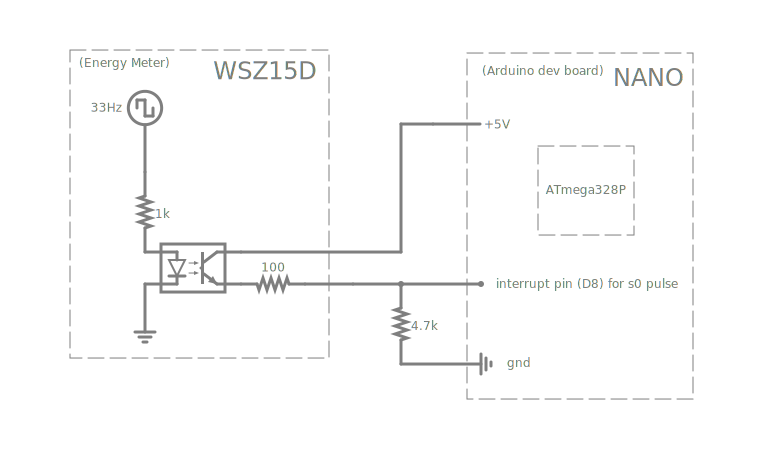

# Arduino_ATmega328P_EnergyMeter_S0-pulse
S0-pulse counter code for Arduino dev boards with ATmega328P MCU

[](https://www.falstad.com/circuit/circuitjs.html?ctz=CQAgjCAMB0l3BWEBmaBOMAmLAOZa0cwFltkQFIKKqEBTAWjDACgAWSAdhUjZ7+QJM-cCwBOIDlWTIAbJNkC5UcHBYAlEZkwDe4WVSrCZ1Q1GgIWAcxEz5yPchx9D1igclh5iqmy8rIFgB3STgRBA8HFw0KNGEwTm8I8ESA0NMAi3EtHVs9KjB4YIUleQQsFGVAiQjpZVrPeV9ONRDy43rIquKGuxAfSqaWACMQbRxVYTYcbj9XAA8UTgmwEzZOJFX5PlyAdQBlAC1iABEWRdkEJGQOECJpNnI+CoBLADsAFzoxMQBXAAcPgAdADO-3eoIAFCccABKUEAMwA9mJQSDIKD-r8ADYgug9DwJMqRfLnfqybZgND9HDbbSScDCKxvAAmI36mHkhSQOCEknKUAJBVSCDiKSGi04nHiTjufnA8p2fAAcgBBZUAeTJiggWG4nHW4AcDIqkNVYhZv3eSNBLLoADdQcMkQBDC2wsmYWXManIMArenPYSQgCib2+VgAnqCALJ0L5iD2SwpjNjyZbCHTUoMgVUAFQAtnQrC7SDgAArs2RobhUiacNDkTAzQVI8AQRQqDgEVTmeCQGuXWSYJBGdsoFhAA)

>Pulse interface S0 according to DIN EN 62053-31, potential free by opto-coupler, max. 30 V DC/2O mA and min. 5 V DC.
Impedance 100 ohms.

The energy meter has an open collector interface that can be used to read pulses from it. Every pulse equals a constant amount of energy e.g. 2000 Imp./kWh -> 1 pulse = 0.5 watt hours (1800 Joule). Every pulse has the same length e.g. 30ms .
By counting the pulses, the used energy over a period of time can be calculated.

The code below measures the time between the rising edge and falling edge in an interrupt service routine (ISR) by using the Timer1 ICR1 register to calculate the time difference.
The ISR is kept as short as possible (but it takes time to execute). If the measured pulse length falls into a defined time window, then the pulse is considered valid and added to an internal static pulse counter.
Refer to the ATmega328P datasheet for more information. 

 ```C++
const double TIMEDIFFMULT = 0.064; // 16MHz clock

volatile uint16_t wsz_counter = 0;
volatile uint8_t wsz_counter_read = 0;

ISR(TIMER1_CAPT_vect)
{
    static uint16_t pulseCounter = 0;
    static double duration = 0;
    static uint16_t clockStart = 0;
    static uint16_t clockEnd = 0;

    uint8_t risingEdge = TCCR1B & (1 << ICES1);
    uint16_t clock = ICR1;
     
    if (risingEdge)
    {
        clockStart = clock;
        clockEnd = 0;

        TCCR1B &= ~(1 << ICES1); // set input capture edge select to falling edge
    }
    else // falling edge
    {
        clockEnd = clock;
        if (clock >= clockStart)
        {
            duration = (double)(clockEnd - clockStart) * TIMEDIFFMULT;
        }
        else
        {
            duration = (double)(((uint16_t)(UINT16_MAX)-clockStart) + clockEnd) * TIMEDIFFMULT;
        }

        if (15.0 <= duration && duration < 45.0) // pulse length check for ~30ms
        {
            pulseCounter++;
        }

        if (pulseCounter > 0)
        {
            if (wsz_counter_read == 0 && wsz_counter == 0)
            {
                wsz_counter = pulseCounter;
                wsz_counter_read = 1;
                pulseCounter = 0;
            }
        }

        TCCR1B |= (1 << ICES1); // set input capture edge select to rising edge
    }

    TIFR1 |= (1 << ICF1); // clear ICF1 flag after edge detection change (15.6.3 by writing a logical one to the I/O bit location)
}

void setup()
{
    Serial.begin(9600);

    cli();
    // NANO ICP1 pin is D8

    PORTB &= ~(1 << PORTB0); // disable ICP1 pull-up
    DDRB &= ~(1 << DDB0);    // set ICP1 pin direction to input (0)

    // 15.11.1 TCCR1A – Timer/Counter1 Control Register A
    TCCR1A = 0; // set OC1A/OC1B disconnected, top 0xFFFF

    // 15.11.2 TCCR1B – Timer/Counter1 Control Register B
    TCCR1B = 0;

    // clk/1024 => every 0.064 ms
    TCCR1B |= (1 << CS12);
    TCCR1B &= ~(1 << CS11);
    TCCR1B |= (1 << CS10);

    TCCR1B |= (1 << ICNC1); // set 4 cycle noise canceller bit
    TCCR1B |= (1 << ICES1); // set input capture edge select to rising edge

    // clear ICF1 before enabling input capture interrupts
    TIFR1 |= (1 << ICF1);

    // 15.11.8 TIMSK1 – Timer/Counter1 Interrupt Mask Register
    TIMSK1 |= (1 << ICIE1); // set capture interrupt enabled

    // ICR1 = UINT16_MAX;

    sei();
}

void loop()
{
    
    delay(1000); // or do something useful instead    
    
    if (wsz_counter_read == 1)
    {
        Serial.print(wsz_counter); // output to host (to be added to a persistent data entity)
        wsz_counter = 0;
        wsz_counter_read = 0;
    }
    else
    {
        Serial.print(0);
    }
  
    Serial.println();
}

```

